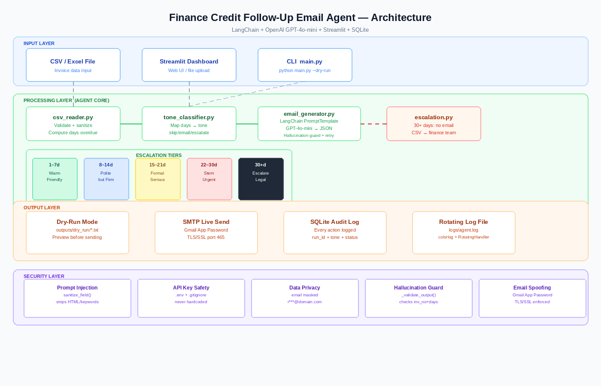

# Finance Credit Follow-Up Email Agent

An AI-powered agent that automatically generates professional follow-up emails for overdue invoices, with tone escalation based on days overdue, full audit trail, dry-run mode, and human escalation for critical cases.

---

## Project Overview

Finance teams spend significant time manually chasing overdue payments. This agent automates the entire workflow:

- Reads invoice data from CSV or Excel
- Detects overdue invoices automatically
- Generates AI-powered emails with tone that escalates based on days overdue and follow-up count
- Saves emails locally in dry-run mode before any real sending
- Logs every action to a SQLite audit trail
- Escalates 30+ day invoices to finance/legal team with no email sent to client
- Runs automatically on a daily schedule via APScheduler

---

## Setup Instructions

### Step 1 — Clone the repository
```bash
git clone https://github.com/adityapratapsingh05/finance-email-agent.git
cd finance-email-agent
```

### Step 2 — Install dependencies
```bash
pip install -r requirements.txt
```

### Step 3 — Configure environment
```bash
cp .env.example .env
```
Open `.env` and add your OpenAI API key and Gmail credentials.

### Step 4 — Run in dry-run mode (recommended first)
```bash
python main.py --file data/sample_invoices.csv --dry-run
```
Generated email previews are saved to `outputs/dry_run/`

### Step 5 — Run Streamlit dashboard (optional UI)
```bash
streamlit run app.py
```
Open `http://localhost:8501` in your browser.

### Step 6 — Run with live email sending (optional)
```bash
python main.py --file data/sample_invoices.csv --live
```
Requires `GMAIL_USER` and `GMAIL_APP_PASSWORD` in `.env`

### Step 7 — Run on a daily schedule (optional)
```bash
python scheduler.py
```
The agent runs automatically at 09:00 every day in dry-run mode. Edit `SCHEDULE_HOUR` in `scheduler.py` to change the time.

---

## Architecture Diagram



### System Layers

```
INPUT LAYER
  CSV / Excel File  →  Streamlit Dashboard  →  CLI (main.py)  →  Scheduler (scheduler.py)
        ↓
PROCESSING LAYER
  csv_reader.py  →  tone_classifier.py  →  email_generator.py
                           ↓ (30+ days)
                      escalation.py  →  Finance/Legal Team
        ↓
OUTPUT LAYER
  Dry-Run .txt files  |  SMTP Live Send  |  SQLite Audit Log  |  Log Files
        ↓
SECURITY LAYER
  Prompt Injection Guard  |  API Key Protection  |  Data Privacy
  Hallucination Prevention  |  Email Spoofing Prevention  |  Access Control
```

**Agent Architecture — Sequential Chain:**
```
load_invoices() → classify_tone() → generate_email() → save_dry_run() → log_action()
```
No ReAct loop is needed — this is a deterministic batch processing workflow where each invoice is processed independently in sequence.

---

## LLM Choice — GPT-4o-mini

**Model:** `gpt-4o-mini-2024-07-18` via OpenAI API

**Why GPT-4o-mini over alternatives:**

| Model | Reason Not Chosen |
|---|---|
| GPT-4o | 10x more expensive, overkill for email generation |
| Claude 3.5 Sonnet | Excellent but requires separate API key setup |
| Gemini 1.5 Flash | Good but JSON output less reliable for structured tasks |
| Llama 3 (local) | Requires GPU, not student-friendly |

**Why GPT-4o-mini is the right choice:**
- Low cost (~$0.00015 per email generation)
- Reliable structured JSON output via LangChain
- 128k context window — handles large invoice batches
- Excellent instruction following for tone control
- Tool-calling support for future agentic extensions

---

## Agent Framework — LangChain

**Framework:** LangChain v0.2.16

**Why LangChain over alternatives:**

| Framework | Reason Not Chosen |
|---|---|
| CrewAI | Multi-agent overkill for single-agent task |
| LangGraph | Graph complexity not needed for linear workflow |
| AutoGen | Conversational focus, not suited for batch processing |

**Why LangChain:**
- `PromptTemplate` gives clean, testable prompt management
- `ChatOpenAI` wrapper handles retries and error handling
- `StrOutputParser` makes JSON extraction straightforward
- Large community, excellent documentation
- Simple chain pattern: `prompt | llm | parser`

---

## Tone Escalation Matrix

| Stage | Trigger | Tone | Key Message | CTA |
|---|---|---|---|---|
| 1st Follow-Up | 1–7 days overdue | Warm & Friendly | Gentle reminder, assume oversight | Pay now link |
| 2nd Follow-Up | 8–14 days overdue | Polite but Firm | Payment still pending | Confirm payment date |
| 3rd Follow-Up | 15–21 days overdue | Formal & Serious | Escalating concern | Respond within 48 hrs |
| 4th Follow-Up | 22–30 days overdue | Stern & Urgent | Final reminder before escalation | Pay immediately or call us |
| Escalation Flag | 30+ days overdue | NO EMAIL | Human review required | Assigned to finance manager |

**Trigger Logic:** Stage is determined by `max(days_overdue_tier, followup_count_tier)` — whichever is higher wins. This ensures a client who has already received multiple follow-ups gets the appropriate escalated tone even if not many days have passed.

---

## Prompt Design

### System Prompt Structure
```
You are a professional accounts receivable assistant for {company_name}.

TASK: {tone_instruction}

INVOICE DETAILS - use EXACTLY these values:
Client Name: {client_name}
Invoice Number: {invoice_no}
Amount Due: Rs.{amount_due}
Due Date: {due_date}
Days Overdue: {days_overdue} days
Payment Link: {payment_link}
CTA: {cta_instruction}

STRICT RULES:
- Use exact invoice number and amount shown above
- Include the payment link
- Include the specific CTA instruction
- Do NOT invent any information

Return ONLY valid JSON with no markdown.
```

### Guardrails Applied
1. All invoice fields injected as variables — LLM cannot ignore them
2. Explicit "do NOT invent" instruction prevents hallucination
3. JSON-only output enforced — no free text allowed
4. `_validate_output()` checks invoice_no present in output after generation
5. Auto-retry up to 2 times if validation fails

---

## Security Mitigations

### 1. Prompt Injection Prevention
**Risk:** Malicious data in CSV fields manipulating LLM behaviour

**Mitigation:** `sanitize_field()` in `utils/csv_reader.py` strips HTML tags and known injection keywords (`ignore`, `forget`, `disregard`, `system`, `prompt`, `instruction`, `override`, `jailbreak`) from all text fields before they enter the prompt.

```python
def sanitize_field(value):
    value = re.sub(r"<[^>]+>", "", value)
    for word in ["ignore","forget","disregard","system","prompt","instruction","override"]:
        value = re.sub(word, "", value, flags=re.IGNORECASE)
    return value[:500].strip()
```

---

### 2. API Key Protection
**Risk:** OpenAI and Gmail credentials leaked in source code

**Mitigation:**
- All credentials stored in `.env` file using `python-dotenv`
- `.env` is listed in `.gitignore` — never pushed to GitHub
- `.env.example` provided with placeholder values only
- No credentials hardcoded anywhere in source code

---

### 3. Data Privacy (PII Protection)
**Risk:** Client email addresses and personal data exposed in logs

**Mitigation:** Email addresses are masked in all audit log entries:
```python
masked = email[0] + "***@" + email.split("@")[1]
# rahul@example.com → r***@example.com
```
Full email only used at the point of sending — never stored in plaintext in logs.

---

### 4. Hallucination Prevention
**Risk:** LLM generating wrong invoice numbers, amounts, or fabricated information

**Mitigation:**
- All invoice fields passed as explicit template variables
- `_validate_output()` checks that invoice_no appears in generated email body
- Body length check — rejects suspiciously short outputs
- Auto-retry on validation failure (max 2 retries)
- JSON structured output enforced — no free-form text

---

### 5. Unauthorised Access Prevention
**Risk:** Anyone triggering the agent endpoint

**Mitigation:**
- Streamlit runs on `localhost` only by default — not exposed to internet
- CSV schema validated before any processing begins — rejects malformed files
- API key required in environment — agent refuses to run without it
- Note: The Streamlit sidebar allows entering an API key for local/demo use only. In production, keys should be set exclusively via environment variables.

---

### 6. Email Spoofing Prevention
**Risk:** Emails appearing from wrong or spoofed sender address

**Mitigation:**
- Gmail SMTP with App Password only — not raw password
- TLS/SSL enforced on port 465 in `smtp_sender.py`
- Sender address locked to `GMAIL_USER` environment variable
- Dry-run mode is default — no real emails sent during testing
- When sending via Gmail SMTP, SPF and DKIM are automatically handled by Google's mail infrastructure for `@gmail.com` sender addresses. For a production custom domain, configure SPF/DKIM records via your DNS provider and set up DMARC policy accordingly.

---

## Folder Structure

```
finance-email-agent/
├── main.py                          CLI entry point
├── app.py                           Streamlit dashboard
├── scheduler.py                     APScheduler daily automation
├── requirements.txt                 Python dependencies
├── .env.example                     Environment variable template
├── .gitignore                       Excludes .env and sensitive files
├── architecture_diagram.png         System architecture image
├── Finance_Email_Agent_Presentation.pptx  Submission deck
│
├── agent/
│   ├── tone_classifier.py           Maps days/followup_count → tone
│   ├── email_generator.py           LangChain + OpenAI email generation
│   └── escalation.py               30+ day escalation CSV report
│
├── utils/
│   ├── csv_reader.py               Loads, validates, sanitizes CSV/Excel
│   └── logger.py                   Rotating file logger
│
├── database/
│   └── db_manager.py              SQLite audit trail
│
├── email_sender/
│   ├── dry_run_sender.py           Saves email previews as .txt
│   └── smtp_sender.py             Gmail SMTP live sender
│
├── data/
│   └── sample_invoices.csv        7 test invoices covering all tiers
│
└── sample_outputs/
    ├── INV-001_warm_friendly.txt   Stage 1 email example
    ├── INV-002_polite_firm.txt     Stage 2 email example
    ├── INV-003_formal_serious.txt  Stage 3 email example
    ├── INV-004_stern_urgent.txt    Stage 4 email example
    └── INV-005_escalation_report.csv  Escalation report example
```

---

## Sample Output

```
============================================================
DRY-RUN EMAIL PREVIEW
============================================================
To:           rahul@example.com
Invoice No:   INV-001
Client:       Rahul Enterprises
Amount Due:   Rs.45000.0
Days Overdue: 4 days
Tone:         warm_friendly
============================================================
SUBJECT: Friendly Reminder: Invoice INV-001 Payment Due
============================================================

Dear Rahul,

Hope you are doing well! Just a quick friendly reminder that
Invoice INV-001 for Rs.45,000 was due on 05 May 2026 and is
now 4 days overdue.

Please process payment here: https://pay.yourcompany.com/invoice

If you have already sent the payment, please ignore this message.

Warm regards,
Accounts Team - Your Company

============================================================
DRY-RUN - NOT sent. Generated at 20260509_143022
============================================================
```

---

## Future Improvements

- LangSmith / Langfuse tracing for observability and bonus marks
- SendGrid integration for production email sending
- Google Sheets as live data source
- WhatsApp notification integration for escalated cases
- Finance team auto-notification email when escalation report is generated

---

## License

MIT License — for educational and internship submission purposes.
